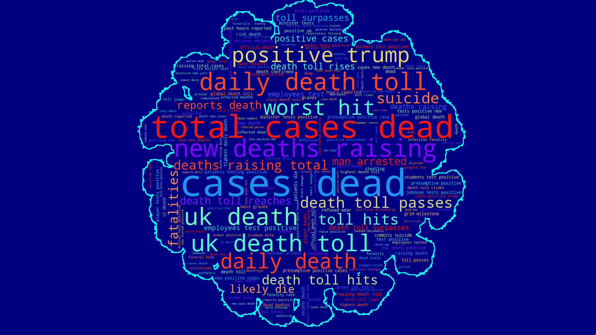
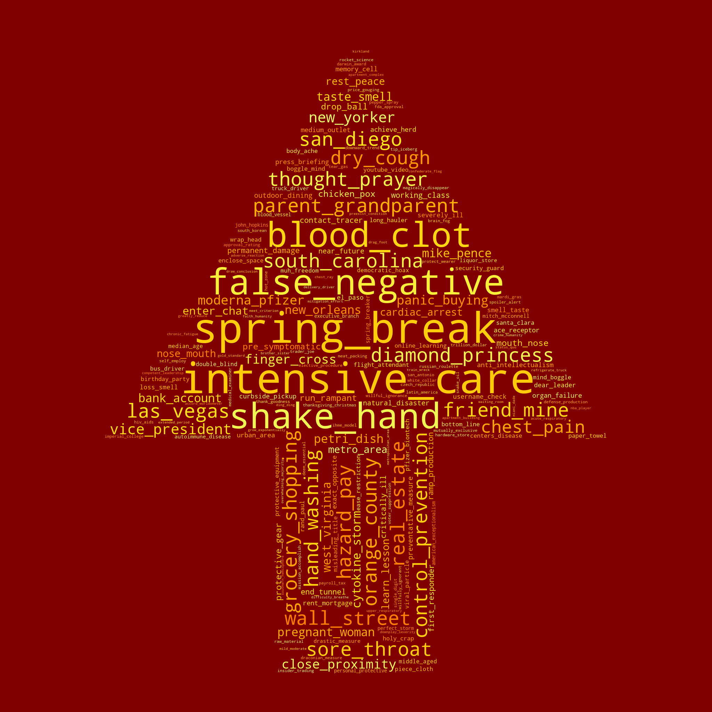

# The first year of the Covid-19 pandemic through the lens of r/Coronavirus subreddit: An exploratory study

# Introduction
This repository contains the python notebooks that covers the complete life cycle for this exploratory study.

## Index

- [About](#about)
- [Usage](#usage)
  - [Installation](#installation)
- [Development](#development)
  - [Development Environment](#development-environment)
  - [File Structure](#file-structure)
- [Gallery](#gallery)

## About
This study looks at the content on Reddit’s COVID-19 community, r/Coronavirus, to capture and understand the main themes and discussions around the global pandemic, and their evolution, over the first year. It is based on 356,690 submissions and 9,413,331 comments corresponding to the period of 20th January 2020 and 31st January 2021. On each of these datasets we carried out analysis based on lexical sentiment and topics generated from unsupervised topic modelling. The study found that negative sentiments show higher ratio in submissions while negative sentiments were of the same ratio as positive ones in the comments. Terms associated more positively or negatively were identified. Upon assessment of the upvotes and downvotes, this study also uncovered contentious topics, particularly “fake” or misleading news. Through topic modelling, 9 distinct topics were identified from submissions while 20 were identified from comments. Overall, this study provides a clear overview on the dominating topics and popular sentiments pertaining to the pandemic during the first year. Our methodology provides an invaluable tool for governments and health authorities to obtain a deeper understanding of the dominant public concerns.

## Usage
The full dataset can be found at: https://doi.org/10.21979/N9/0LGZYN

### Installation
- Download the notebooks and the dataset
- Open the notebooks with Jupyter Notebook or any other Python IDE

## Development

### Development Environment
The project is developed with Python 3.8.
Required packages should be taken care of in the first cell of the notebooks. Otherwise, install them using pip.

### File Structure
Add a file structure here with the basic details about files, below is an example.

| No | File Name | Details 
|----|------------|-------|
| 1  | crawler | notebooks for crawling Reddit data
| 2  | to_csv  | script to convert JSON objects to CSV file
| 3  | preprocess | notebooks for preprocessing Reddit text data
| 4  | exploration | notebooks for exploring cleaned data
| 5  | pickle | contains the datasets
| 6  | masks | contains the word cloud masks

##  Gallery

